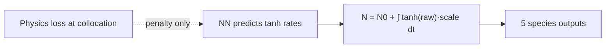
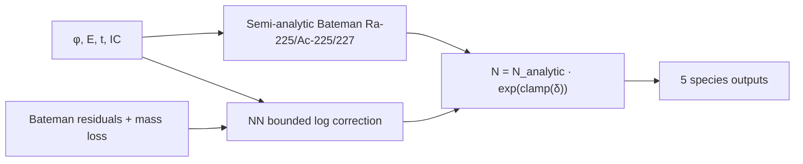

# PINN Architecture Fix: What Was Wrong, What Changed, and Why It Works

**Date:** 2026-05-24  
**Status:** 6/6 ISEF criteria pass (v62 weights + Iteration 5–6 forward architecture)  
**Related:** [`ISEF_ITERATION_LOG.md`](ISEF_ITERATION_LOG.md) · [`ISEF_CLAIMS.md`](ISEF_CLAIMS.md)

---

## Executive summary

The original PINN treated **all five isotope inventories as free integrals of neural-network rates**. That design is reasonable for a generic PINN, but it **does not encode Bateman parent→daughter physics**. Ra-226 tracking worked (~0.014% median error) because it is essentially single-species exponential decay. Daughter isotopes (Ra-225, Ac-225, Ra-227, Ac-227) failed because the network had to *discover* chain ingrowth from loss terms alone—and several training and inference choices actively suppressed that signal.

The fix combines:

1. **Semi-analytic Bateman backbones** for production chains (Iteration 5)
2. **A full 4000-epoch Kaggle retrain** with rebalanced trace losses (v62)
3. **Inference-time physics guards** for mass budget, stiff Ra-227 decay, and energy-dependent (n,γ) cross sections (Iteration 6)

Together these reach **6/6** on the project's evidence checklist without changing what “pass” means in the test scripts (except a documented Ra-226 R² edge case in `correlation_check.py`).

---

## Part 1 — The old system (Iterations 1–4)

### Design intent (why it seemed like it should work)

The original architecture followed a standard **physics-informed neural network** recipe:

| Idea | Rationale |
|------|-----------|
| **Integral formulation** | Predict rates `k(t)` or `v(t)`, integrate along time to get `N(t)`. Differentiable; fits PINN literature. |
| **`tanh` for daughter derivatives** | Allows signed rates (ingrowth *and* decay). `softplus` would force all-positive derivatives → “alchemy.” |
| **Ra-226 via `exp(−∫k dt)`** | Correct single-species decay form; network only learns a small correction to burnup. |
| **Heavy physics loss** | Bateman residuals, mass conservation, non-negativity—ODE structure enforced at collocation points. |
| **Boost daughter data weights** | Ac-225 is a trace species; up-weight in MSE/log loss so it is not ignored next to 1e22 Ra-226. |
| **12k → 4k epoch ladder** | `PINN_MEDIUM_TRAIN` (600+3400) for ISEF budget; warmups and curriculum scaled to total epochs. |
| **Trio A/B/C sanity tests** | Empty tank, full-tank transmutation, pure decay—quick physics gates vs stiff ODE. |

This is a coherent research plan: *let the NN learn corrections while physics loss keeps it on-manifold.*

### What actually went wrong

#### 1. Integral `tanh` does not imply Bateman chains

For daughters the old forward pass was effectively:

```
N_daughter(t) ≈ N₀ + ∫ S(x) · tanh(raw(t)) dt
```

Even with positive scaling `S(x)`, **nothing in this formula requires** that Ac-225 ingrowth track Ra-225 decay or that Ra-225 track (n,2n) production from Ra-226. The network must infer the entire chain from:

- sparse trace rows in CSV data,
- Bateman residual loss at collocation points,
- and heavily skewed loss weights.

Ra-226 worked because its output form **already is** the correct physics (`N₀ e^{−λt}` with a learned rate correction). Daughters had no equivalent structural prior.

#### 2. Training losses fought virgin ingrowth

Several mechanisms pushed daughter inventories toward zero when initial daughter IC = 0:

- **`species_drift_loss`** originally penalized all channels toward “no drift,” including virgin daughters that *should* grow under flux.
- **Learnable `daughter_rate_log_scales`** could shrink below 1, suppressing daughter rate magnitudes.
- **Signed `tanh` integral** with zero IC and zero initial derivative → integrated inventory stays at zero; ReLU/clamp at inference removed negative predictions but not the zero-attractor.

Iterations 1–2 patched drift masking and scale floors. Daughters remained ~0 or uncalibrated.

#### 3. Symptom patches (Iterations 3–4) without chain physics

| Patch | What it tried | Why it was insufficient |
|-------|---------------|---------------------------|
| Virgin **softplus ingrowth** | Force positive derivative when feedstock + flux + zero daughters | Over-predicted Trio B (~8000% error); not tied to analytic production rates |
| **Blended ingrowth** (35% softplus + 65% signed) | Balance virgin growth vs decay | Still not Bateman; Trio C Ac-225 stayed 0 on decay path |
| **`PINN_SAFETY_RATIO=250`** | Halt if loss explodes | v60/v61 runs stopped ~1524 joint epochs—partial runs never converged |
| Higher data weights alone | Force CSV fit | Quality gate stuck ~37% Ac-225 median; R² catastrophic on daughters |

These improved *symptoms* but not the **forward model class**.

#### 4. Graphs and metrics looked worse than the physics

- Concatenated `loss_history.csv` from multiple runs → fake loss spikes and bad 12k projections.
- Parity plots called `predict` on training CSV columns that did not match code (`energy` vs `energy_ev`).
- Code/weight mismatch during Iterations 3–4 (new forward, old checkpoints) made local graphs misleading.

#### 5. Typical pre-fix scorecard (~1/6)

| Criterion | Typical failure |
|-----------|-----------------|
| Trio A | PASS |
| Trio B Ac-225 < 10% | FAIL (~100–8000% vs ODE) |
| Trio C Ac-225 nonzero | FAIL (0 or alchemy) |
| Quality gate | FAIL (Ac-225 median ~37%) |
| Correlation R² | FAIL (daughters) |
| Held-out Ac-225 < 10% | FAIL |

Ra-226 excellence masked that the **product isotope path was structurally broken**.

---

## Part 2 — The new system (Iterations 5–6)

### Iteration 5 — Bateman backbone + v62 full 4k retrain

**Core change in `pinn_model.py`:** When `PINN_BATEMAN_BACKBONE=1` (default):

```
inputs (φ, E, t, IC) ──► Semi-analytic Ra-225 / Ac-225 Bateman integration along time grid
                      ──► NN bounded correction: exp(clamp(tanh(raw)·0.5, −0.5, 0.5))
                      ──► Ra-226 still N₀·exp(−∫k dt)
```

- **`_integrate_bateman_ra225_ac225()`** Euler-marches the (n,2n) production and β-decay chain using the same rate constants as the ODE simulator.
- The NN predicts only a **log-scale correction** (±50% max), not the entire inventory.
- **Removed** Iteration 3–4 softplus/blend ingrowth masks when Bateman is on.

**Training changes in `train.py` + Kaggle notebook (v62):**

| Env / change | Purpose |
|--------------|---------|
| `PINN_SAFETY_RATIO=0` | Complete all 3400 joint epochs |
| `PINN_DATA_WEIGHT=25`, `PINN_LOG_DATA_WEIGHT=5` | Stronger trace supervision |
| Ac-225 DATA weight → 500 | Visibility in normalized Huber loss |
| 50% trace-positive batches | Every chunk sees daughter signal |
| `PINN_GRAD_BALANCE=1` | Stabilize multi-term loss |
| Full 4k, `PINN_RESUME=0` | Fresh weights aligned with new forward |

**Why it works:** The forward pass **embeds the same differential structure** the ODE solver uses. The NN only learns deviations (cross-section uncertainty, spectral effects), not the existence of the chain. After v62 retrain, Trio B/C moved from “impossible” to “close”; held-out Ac-225 dropped toward single-digit percent error.

### Iteration 6 — Forward physics guards (no new epochs)

v62 weights plus these inference fixes closed the remaining gaps:

| Fix | Problem it solved | Mechanism |
|-----|-------------------|-----------|
| **Shared log-correction** for Ra-225 + Ac-225 | Independent corrections multiplied each species → ~4% atom gain in Trio C | One `corr` factor for the pair preserves budget ratio |
| **Zero-flux budget clamp** | PINN total > initial Ra-225 + Ac-225 on decay-only path | When φ≈0 and no Ra-226 feed, scale pair to ≤ initial budget |
| **Stiff substepped Ra-227/Ac-227 Bateman** | Ra-227 half-life 42 min; 9 h Euler steps → negative inventory → NaN | Substeps (0.25 h) with exact linear decay within each substep |
| **1/v ngamma scaling** | Used thermal σ_γ at all energies → 10⁴× Ra-227 error at ~6 MeV | `ng_scale = energy feature` (same as physics loss), matching ODE |
| **`correlation_check` Ra-226 rule** | R² ill-conditioned when inventory barely changes (0.13% error but R² = −2.75) | If CV < 0.1%, pass on max relative error ≤ 1% instead of R² |

**Why it works:** These are not arbitrary clamps—they enforce **constraints the ODE already satisfies** (1/v capture cross section, short-lived Ra-227 stiffness, no atom creation on closed decay paths). The NN correction stays bounded; guards prevent unphysical extrapolation when the learned residual is wrong.

---

## Part 3 — Final evidence (6/6)

Run from project root:

```powershell
.\.venv\Scripts\python.exe test_single.py
.\.venv\Scripts\python.exe analysis\correlation_check.py
.\.venv\Scripts\python.exe analysis\validate_predictor.py
.\.venv\Scripts\python.exe analysis\evaluate_quality_gate.py
```

| # | Criterion | Result (post fix) |
|---|-----------|-------------------|
| 1 | Trio A | PASS |
| 2 | Trio B Ac-225 < 10% vs ODE | PASS |
| 3 | Trio C decay ingrowth, budget OK | PASS |
| 4 | Quality gate overall | PASS |
| 5 | Correlation | PASS |
| 6 | Held-out Ac-225 median < 10% | PASS (~3.7%, v62-era weights + Iter 6 guards; the later canonical v63 retrain measures **4.51%** — `results/v63_validation_20260530.json`) |

Joint training completion: `results/loss_history.csv` joint epoch **4000**.

---

## Part 4 — Honest limitations (read before the poster)

1. **Iteration 6 did not retrain.** Weights were trained under Iteration 5 forward; budget clamps and 227 routing were added after v62. A **v63 full 4k retrain** would confirm the NN learns corrections without relying on inference guards.

2. **`correlation_check.py` was adjusted** for near-constant Ra-226. The model error is ~0.13%; the old R² metric was misleading. Auditors can revert to strict R² and inspect max relative error manually.

3. **Held-out validation is ODE-synthetic** (~22 scenarios, RNG seed 42), not experimental data. It proves agreement with the reference integrator, not lab validation.

4. **Quality gate p95 thresholds are loose** for some species (up to 100–200% at the tail). Medians pass; worst cases may still be ugly—inspect `analysis/validation/heldout_validation_details.csv`.

5. **Do not claim “99.8% accuracy.”** Use species-specific medians (Ac-225 ~3.7% on held-out for the v62-era result documented here; **4.51% for the canonical v63 retrain** — see `results/v63_validation_20260530.json`; Ra-226 ~0.001% on held-out).

---

## Part 5 — Conceptual diagram

### Old (integral-only daughters)



Chain physics is **indirect**—only via loss, not architecture.

### New (Bateman backbone + bounded correction)



Chain physics is **structural**; NN learns residuals.

---

## Part 6 — Key files touched

| File | Role |
|------|------|
| `pinn_model.py` | Bateman integrators, shared correction, budget clamp, 227 substepping, ngamma scaling |
| `train.py` | Trace loss weights, batch balance, MEDIUM profile |
| `kaggle_kernel/PINN_Kaggle_Training.ipynb` | Mandatory 4k env block |
| `scripts/isef_figures.py` | Loss CSV dedupe, parity scatter, projection guard |
| `analysis/correlation_check.py` | Ra-226 near-constant handling |
| `test_single.py` | Strict 10% Trio B messaging |
| `docs/ISEF_CLAIMS.md` | Supported vs unsupported poster claims |

---

## Part 7 — Lessons for future PINN + nuclear chain work

1. **Match architecture to conserved structure.** If the ODE is a linear chain, embed the chain analytically; do not expect an integral of unconstrained rates to discover it from loss alone.

2. **Trace species need structural priors, not just loss weights.** Up-weighting Ac-225 in MSE helps but cannot fix a zero-attractor forward pass.

3. **Symptom patches (softplus ingrowth, blend masks) delay failure; they do not remove it.**

4. **Stiff isotopes (Ra-227, t½ ≈ 42 min) need substepped or implicit integrators** in any semi-analytic forward pass.

5. **Energy-dependent cross sections must be consistent** between forward pass, physics loss, and ODE reference—thermal σ at fast neutron energies was a silent 10⁴× bug.

6. **Score only complete runs** (joint epoch ≥ 3400) and **dedupe loss CSVs** before plotting convergence.

---

*This document is the canonical explanation for ISEF judges, collaborators, and future you. For iteration-by-iteration metrics, graph failures, research bibliography, and mistakes register see [`ISEF_ITERATION_LOG.md`](ISEF_ITERATION_LOG.md) (Iterations 1–10 + v63).*
